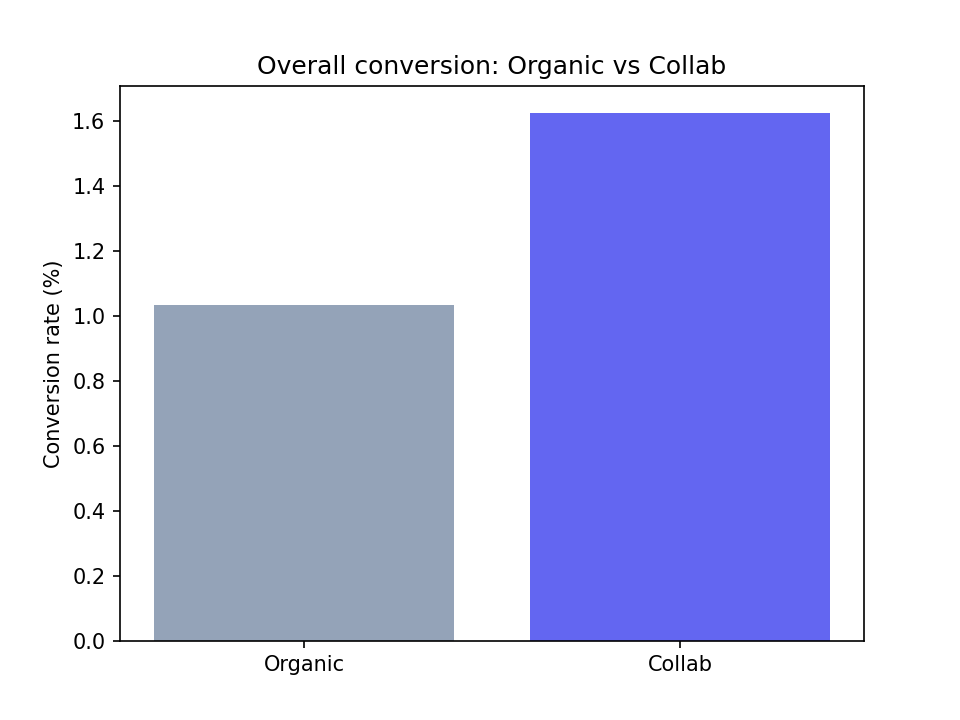

# Influencer Collab A/B Test — Does Paid Influencer Content Beat Organic Brand Posts?


A hypothesis-testing analysis of a simulated Instagram retargeting campaign for a D2C skincare brand: does a paid influencer collaboration post outperform an organic brand post, and if so, where in the funnel does the lift actually come from?



## Why synthetic data — deliberately

Rather than use a public dataset, this project generates its own data with documented, chosen ground-truth effects (see the `ctr_lookup` table and conversion-probability logic in `analysis_full.py`). This means every result can be checked against a known true answer — a stronger demonstration of statistical understanding than analyzing a dataset where the "right answer" isn't independently knowable, and it avoids duplicating the widely-reused public "ad vs PSA" A/B test dataset that shows up in dozens of near-identical student projects.

## Setup

60,000 users are randomly split 50/50 into:
- **Organic (control)**: sees a normal organic brand post
- **Collab (treatment)**: sees a paid influencer collaboration post

Both link to the same landing page. Two funnel stages are tracked — click-through (did they visit the landing page?) and conversion-given-click (did they buy?) — along with content format (reel/static) and, for the collab group, influencer tier (nano/micro/macro).

## Results

| Metric | Organic | Collab | z-statistic | p-value |
|---|---|---|---|---|
| Overall conversion | 1.03% (95% CI 0.93–1.15%) | 1.63% (95% CI 1.49–1.78%) | 6.335 | <0.00001 |
| Click-through rate | 6.19% | 8.07% | 8.976 | <0.00001 |
| Conversion given click | 16.71% | 20.15% | 2.859 | 0.00424 |

**Headline finding**: Collab converts at 1.63% vs organic's 1.03% — a 58% relative lift that is highly statistically significant. The 95% confidence intervals for the two groups don't overlap, so this isn't just a statistically-detectable-but-tiny effect — it's a meaningfully sized one.

**Funnel decomposition — the more interesting finding**: the click-through gap is far more statistically certain (z=8.976) than the conversion-given-click gap (z=2.859), even though both are significant. This means the lift is mostly a traffic-quality story — the collab post gets meaningfully more people to click — rather than a landing-page story where clicked users convert at a dramatically higher rate once they arrive. That distinction matters for where the business should invest next: proven, high-certainty lever (creative/influencer selection) vs. a real-but-noisier lever (landing page optimization).

**Segment breakdown** (collab group only):

| Format | Tier | CTR | CVR |
|---|---|---|---|
| Reel | Micro | 11.31% | 2.04% |
| Reel | Macro | 9.62% | 1.92% |
| Static | Macro | 7.80% | 1.73% |
| Reel | Nano | 7.25% | 1.30% |
| Static | Micro | 6.84% | 1.44% |
| Static | Nano | 5.58% | 1.30% |

Reel + micro-influencer is the standout combination, beating reel + macro despite macro's larger raw audience. There's a clear interaction effect: reel format helps across every tier, and micro-influencer is the strongest performer specifically within reel — relevance is outperforming raw reach.

## Recommendation

Shift collab budget toward micro-influencers producing reel content rather than defaulting to macro-influencer reach. Treat the click-through lift as the confirmed, high-confidence driver; treat the landing-page conversion gap as a real but less certain effect worth a dedicated follow-up test before committing major resourcing to landing-page changes.

## Talking points to have ready

- **Why a two-proportion z-test**: comparing two independent binomial proportions (conversion rate in each group) is exactly what this test is built for — it answers whether an observed gap is likely to be random noise or a real effect.
- **Why Wilson confidence intervals, not the basic normal-approximation interval**: conversion rates here are low (~1-2%), and the basic interval can behave poorly (even producing invalid bounds) at low proportions — Wilson is more reliable in that range.
- **Why decompose the funnel instead of stopping at the headline result**: the overall conversion test alone doesn't say *why* collab wins. Breaking it into CTR and CVR-given-click showed the two stages have very different statistical certainty (z=8.976 vs z=2.859) — which changes the actual business recommendation.
- **What would change the recommendation**: if CVR-given-click had shown *no* significant difference at all, the story would simplify to "collab just gets more clicks, full stop" — the current result (a real but weaker CVR effect) is what justifies flagging the landing page as a secondary, lower-confidence lever rather than ignoring it entirely.

## Skills demonstrated

- Experimental design: randomized controlled assignment, avoiding confounding
- Two-proportion z-tests, Wilson confidence intervals, statistical vs. practical significance
- Funnel/stage decomposition to isolate *where* an effect originates, not just whether it exists
- Segment analysis with interaction effects (format × influencer tier)
- Translating statistical output into a specific, defensible business recommendation

## Files

```
.
├── analysis_full.py         # full pipeline: data generation, all 3 hypothesis tests, segmentation, chart
├── influencer_ab_test.csv   # the generated dataset (60,000 rows)
├── requirements.txt
├── preview/
│   └── 01-results-overview.png
└── README.md
```

## Tools

Python (pandas, numpy, statsmodels, matplotlib) — two-proportion z-tests, Wilson confidence intervals.

## Setup / running it yourself

```bash
pip install -r requirements.txt
python analysis_full.py
```
This regenerates the dataset and reruns the full analysis end to end — output matches the results above exactly (seeded random generation).

## Pushing to GitHub

```bash
cd influencer-ab-test
git init
git add .
git commit -m "Add influencer collab A/B test: hypothesis testing and funnel decomposition"
git branch -M main
git remote add origin https://github.com/<your-username>/influencer-ab-test.git
git push -u origin main
```
